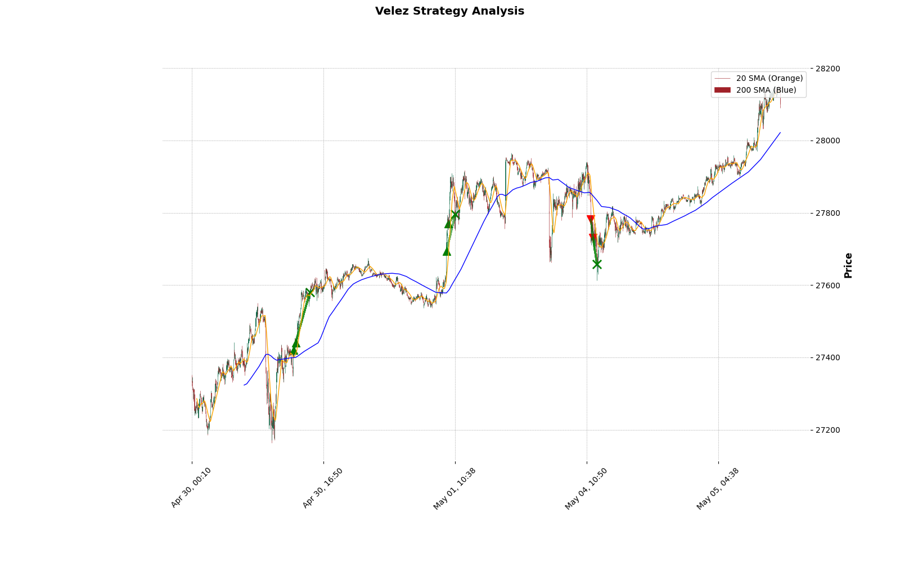
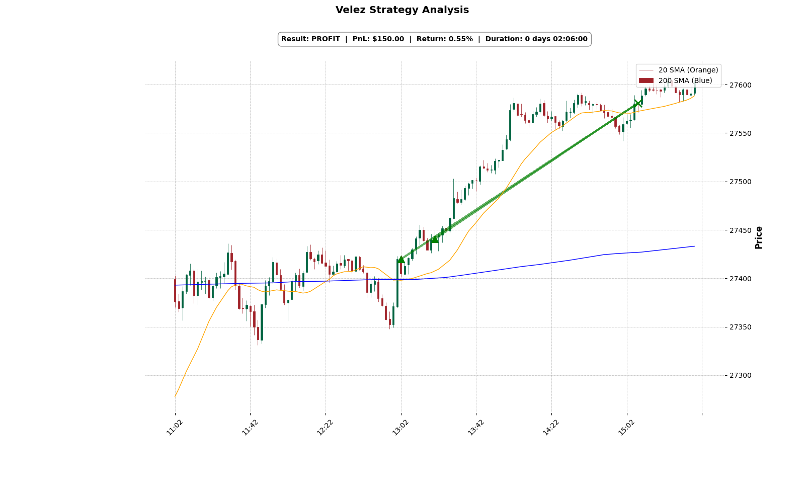

# Oliver Velez Trading Strategy

## Experimental Trading Bot
- Python souce code
- Docker environment for python: pytorch with AMD RocM GPU support   
- Vibe coded with help from [Google Gemini](https://gemini.google.com/app)  
- Inspired by Oliver-Velez_Trade-Only-the-First-20-Minutes_YouTube.pdf  
	+ [Oliver Velez Trading](https://youtu.be/6XtBCqBhQ-k?si=xc_JXKNEtNJ2W21c) Why I Trade Only the First 20 Minutes of the Market
- Not Financial Advice! This is Experimental Software. <i><b>Use At Your Own Risk!</b></i>

### Usage
```
# build the container environment
    $ podman build -t localhost/rocm-pytorch .
# run the container...
    $ ./run-torch-rocm.sh 
# inside the container...
    [workspace]# cd /app
    [app]# python main.py
```

### Development System
Operating System: Fedora Linux 43 <br/>
KDE Plasma Version: 6.6.4 <br/>
KDE Frameworks Version: 6.25.0 <br/>
Qt Version: 6.10.3 <br/>
Kernel Version: 6.19.12-200.fc43.x86_64 (64-bit) <br/>
Graphics Platform: Wayland <br/>
Processors: 8 × AMD Ryzen 5 PRO 2500U w/ Radeon Vega Mobile Gfx <br/>
Memory: 8 GiB of RAM (6.6 GiB usable) <br/>
Graphics Processor: AMD Radeon Vega 8 Graphics <br/>
Manufacturer: LENOVO <br/>
Product Name: 20MVS03800 <br/>
System Version: ThinkPad A485 <br/>
  
    
### Source Files

```
688     velez/data/trades/2026-05-05-16h39m49s
688     velez/data/trades
0       velez/data/.triton/cache
0       velez/data/.triton
828     velez/data
968     velez/

daveray@fedora:~/Documents/nq-trader-app/workspace/velez$ ls -lat
total 60
-rw-r--r--. 1 daveray daveray    644 May  5 09:59 main.py
-rw-r--r--. 1 daveray daveray   6285 May  5 09:59 TradeVisualizer.py
-rw-r--r--. 1 daveray daveray   1687 May  5 09:59 BacktestEngine.py
-rw-r--r--. 1 daveray daveray   2023 May  5 09:59 DataManager.py
-rw-r--r--. 1 daveray daveray   6733 May  5 09:59 OliverVelezStrategy.py
-rwxr-xr-x. 1 daveray daveray    175 May  5 09:59 pytorch_memory_check.py
-rw-r--r--. 1 daveray daveray    449 May  5 09:59 test_gpu.py
-rw-r--r--. 1 daveray daveray    106 May  5 09:58 requirements.txt
-rw-r--r--. 1 daveray daveray   1833 May  5 09:58 Dockerfile
-rwxr-xr-x. 1 daveray daveray    699 May  5 09:58 run-torch-rocm.sh
-rw-r--r--. 1 daveray daveray   4492 May  5 09:57 readme.md
-rw-r--r--. 1 daveray daveray  50800 May  4 12:32 Oliver-Velez_Trade-Only-the-First-20-Minutes_YouTube.pdf
drwxr-xr-x. 1 daveray daveray    374 May  5 09:57 .
drwxr-xr-t. 1 daveray daveray     64 May  5 09:33 data
-rw-r--r--. 1 daveray daveray     64 May  5 08:27 amdgpu-fix.conf

```

### Sample output    
```
[root@feef7140f56b app]# python main.py
Downloading fresh history for NQ=F...
[*********************100%***********************]  1 of 1 completed
Visualizer initialized. Run directory: ./trades/2026-05-05-16h33m01s                                                                                    

==============================
 PERFORMANCE STATISTICS 
==============================
Ticker=NQ=F                   Contract Size=1
Start                     2026-04-30 00:10:00
End                       2026-05-05 12:22:00
Duration                      5 days 12:12:00
Exposure Time [%]                     5.55307
Equity Final [$]                   100561.119
Equity Peak [$]                  100601.65295
Commissions [$]                        66.381
Return [%]                            0.56112
Buy & Hold Return [%]                 2.78916
Return (Ann.) [%]                    19.36244
Volatility (Ann.) [%]                 1.67617
CAGR [%]                             29.17373
Sharpe Ratio                         11.55157
Sortino Ratio                             inf
Calmar Ratio                         69.19692
Alpha [%]                             0.51686
Beta                                  0.01587
Max. Drawdown [%]                    -0.27982
Avg. Drawdown [%]                    -0.05173
Max. Drawdown Duration        4 days 02:20:00
Avg. Drawdown Duration        0 days 11:52:00
# Trades                                    6
Win Rate [%]                            100.0
Best Trade [%]                        0.54705
Worst Trade [%]                       0.05361
Avg. Trade [%]                        0.33888
Max. Trade Duration           0 days 02:06:00
Avg. Trade Duration           0 days 01:13:00
Profit Factor                             NaN
Expectancy [%]                        0.33902
SQN                                   4.67954
Kelly Criterion                           NaN
_strategy                 OliverVelezStrategy
_equity_curve                             ...
_trades                      Size  EntryBa...
dtype: object

==============================
 COMPREHENSIVE TRADE LOG 
==============================
          EntryTime            ExitTime  Side  EntryPrice  ExitPrice    PnL  Return%
2026-04-30 13:20:00 2026-04-30 15:08:00  LONG    27440.75   27580.75 129.00     0.47
2026-04-30 13:02:00 2026-04-30 15:08:00  LONG    27419.75   27580.75 150.00     0.55
2026-05-01 09:46:00 2026-05-01 10:40:00  LONG    27769.50   27795.50  14.89     0.05
2026-05-01 09:32:00 2026-05-01 10:40:00  LONG    27693.75   27795.50  90.65     0.33
2026-05-04 11:36:00 2026-05-04 12:08:00 SHORT    27731.50   27657.50  62.92     0.23
2026-05-04 11:20:00 2026-05-04 12:08:00 SHORT    27782.25   27657.50 113.66     0.41

Trade log saved to: ./data/trades/2026-05-05-16h33m01s/trade_log.csv
```

### Trade Visualizer Sample  

#### All Trades


#### BOOM<i>!</i> Ftt-ftt-ftt Ftt-ftt-ftt Ftt-ftt-ftt Ftt-ftt-ftt Ftt-ftt ftt


---
Author: daveray@daveray.net <br/>
Date: 2026-05-05 <br/>
License: [ Apache 2.0 ](https://www.apache.org/licenses/LICENSE-2.0) <br/>
- Not Financial Advice! This is Experimental Software. <i><b>Use At Your Own Risk!</b></i>

--- 
```
   Copyright 2026 David Ray Reizes <daveray@daveray.net>

   Licensed under the Apache License, Version 2.0 (the "License");
   you may not use this file except in compliance with the License.
   You may obtain a copy of the License at

     http://www.apache.org/licenses/LICENSE-2.0

   Unless required by applicable law or agreed to in writing, software
   distributed under the License is distributed on an "AS IS" BASIS,
   WITHOUT WARRANTIES OR CONDITIONS OF ANY KIND, either express or implied.
   See the License for the specific language governing permissions and
   limitations under the License.
```
--- 
--- 


